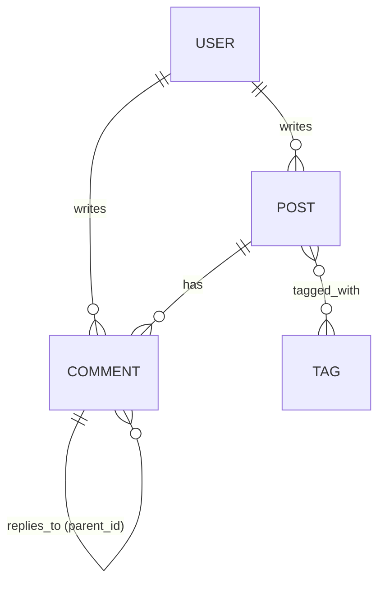

# Chronicle - Backend & Database Architecture

This document outlines the database design, tables, relationships, and commenting architecture for the **Chronicle** fullstack blog application.

---

## 1. Entity Relationship Diagram (ERD)

The database schema is structured around four primary entities: **User**, **Post**, **Comment**, and **Tag**. 



---

## 2. Table Schemas & Definitions

### A. Users Table (`User`)
*   **Purpose**: Manages user registration, authentication, roles, and profiles.
*   **Fields**:
    *   `id` (String, UUID): Unique identifier (Primary Key).
    *   `email` (String): Unique email used for registration/login.
    *   `username` (String): Unique public handle for URL routing (e.g., `/profile/john_doe`).
    *   `password` (String): Hashed password for security.
    *   `name` (String, Optional): Real name of the user.
    *   `role` (String, Default: `"USER"`): Defines authorization permissions. Roles include:
        *   `USER`: Can read posts, write comments, and manage their own profile.
        *   `AUTHOR`: Can also write, edit, and publish posts.
        *   `ADMIN`: Full privileges over all users, posts, and comments.
    *   `bio` (String, Optional): Author bio displayed on posts/profiles.
    *   `avatar` (String, Optional): URL to the user's profile image.
    *   `createdAt` / `updatedAt` (DateTime): Auditing timestamps.

### B. Posts Table (`Post`)
*   **Purpose**: Stores the blog articles written by authors.
*   **Fields**:
    *   `id` (String, UUID): Unique identifier (Primary Key).
    *   `title` (String): The heading of the post.
    *   `slug` (String): Unique URL-friendly version of the title (e.g., `my-first-post`). Indexed for fast lookups.
    *   `content` (String): The markdown or HTML body of the article.
    *   `summary` (String, Optional): Short excerpt for search results or post cards.
    *   `published` (Boolean, Default: `false`): Draft vs. published status.
    *   `coverImage` (String, Optional): Main header image URL.
    *   `authorId` (String): Foreign Key linking to `User.id` (with cascade delete: if a user is deleted, their posts are deleted).
    *   `createdAt` / `updatedAt` (DateTime): Creation and editing timestamps.

### C. Comments Table (`Comment`)
*   **Purpose**: Stores feedback left on articles, supporting nested reply threads.
*   **Fields**:
    *   `id` (String, UUID): Unique identifier (Primary Key).
    *   `content` (String): Text content of the comment.
    *   `postId` (String): Foreign Key referencing the parent `Post.id`.
    *   `authorId` (String): Foreign Key referencing the writing `User.id`.
    *   `parentId` (String, Optional): Foreign Key referencing another `Comment.id` (self-relation). If null, this is a top-level comment.
    *   `depth` (Integer, Default: `0`): The depth level of the comment. Used to easily enforce the 4-layer limit (`0` = top-level, `1` = first reply, `2` = second reply, `3` = third reply).
    *   `createdAt` / `updatedAt` (DateTime): Creation and modification timestamps.

### D. Tags Table (`Tag`)
*   **Purpose**: Allows categorization of posts (e.g. "React", "Node", "Database").
*   **Fields**:
    *   `id` (String, UUID): Unique identifier (Primary Key).
    *   `name` (String): Unique label (e.g., "javascript").
*   **Relationship**: Many-to-Many with `Post` (a post can have many tags, and a tag can be associated with many posts).

---

## 3. The 4-Layer Commenting System Design

To support nested conversations up to **4 layers deep** (where a comment can be replied to, and that reply can have a reply, etc., up to 4 levels), we implement a **self-referencing table relationship**.

### Visualizing the 4 Layers
```
Level 0: [Top-Level Comment by Alice] (depth = 0)
   └── Level 1: [Reply by Bob] (parentId = Alice's ID, depth = 1)
         └── Level 2: [Reply by Charlie] (parentId = Bob's ID, depth = 2)
               └── Level 3: [Reply by Dave] (parentId = Charlie's ID, depth = 3)
                     └── [No further replies allowed here (maximum depth reached)]
```

### Self-Referential Database Relation
In Prisma, the `Comment` model is configured with a self-referencing relationship where:
- A comment **belongs to** one parent comment.
- A comment **has many** child comments (replies).

```prisma
model Comment {
  id        String    @id @default(uuid())
  content   String
  postId    String
  post      Post      @relation(fields: [postId], references: [id], onDelete: Cascade)
  authorId  String
  author    User      @relation(fields: [authorId], references: [id], onDelete: Cascade)
  
  // Self-referencing fields
  parentId  String?
  parent    Comment?  @relation("CommentReplies", fields: [parentId], references: [id], onDelete: Cascade)
  replies   Comment[] @relation("CommentReplies")
  
  depth     Int       @default(0) // 0 = root, 1, 2, 3 (max)
  
  createdAt DateTime  @default(now())
  updatedAt DateTime  @updatedAt
}
```

### Implementation Logic for the 4-Layer Limit

1.  **Creation Validation**:
    When a user attempts to reply to comment `X` (submitting `parentId = X`):
    *   Query comment `X` to get its current `depth`.
    *   If `X.depth >= 3` (where 0 is level 1, 1 is level 2, 2 is level 3, 3 is level 4), reject the request.
    *   Otherwise, save the new comment with `parentId = X` and `depth = X.depth + 1`.

2.  **Fetching Strategies**:
    *   **Flat Fetch + Tree Construction (Recommended)**:
        Query all comments for a post in a single flat list:
        `prisma.comment.findMany({ where: { postId } })`
        Then, construct the nested tree structure in memory in the Node/Express controller. This minimizes database queries and avoids deep joins.
    *   **Recursive Fetch**:
        Query with nested relations using Prisma's `include` statement up to 4 levels:
        ```javascript
        prisma.comment.findMany({
          where: { postId, parentId: null }, // Only top-level
          include: {
            replies: {
              include: {
                replies: {
                  include: {
                    replies: true // 4th level
                  }
                }
              }
            }
          }
        })
        ```

This structure is highly performant, simple to understand for learning backend development, and prevents infinite loops while guaranteeing that the design constraints are satisfied.
